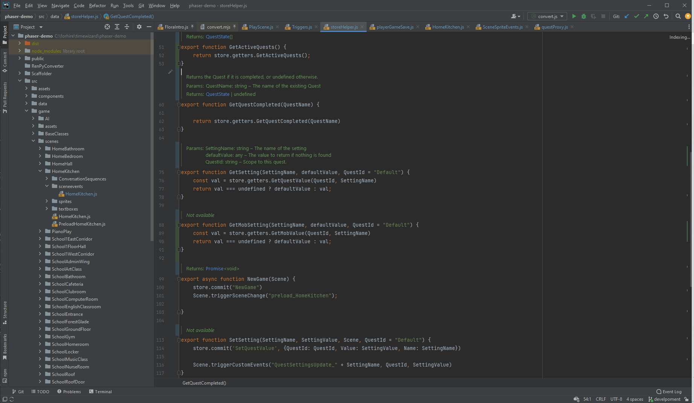

Now with documentation



see: [Render JsDocs](https://www.jetbrains.com/webstorm/guide/tips/rendered-jsdoc-comments/)

# Another Chance Game

## Build Setup

```bash
# install dependencies
npm install

# serve with live reloading at localhost:8080
npm run serve

# build for production with transpilation / minification
npm run build

# serve your production build at localhost:5000
npm start
```


## Scaffolding

# CreateSprite

```bash

# this will run ask you for a scene and a sprite name. This adds no images just the definition and default event.
# if you name it DogSprite it can be access later by that name
npm run CreateSprite

```
# CreateQuest
```bash

# this will run ask you for a scene and a sprite name and a quest name. This adds a quest handler for the sprite
npm run CreateQuest

# All sprites have a default Quest called Default that is included by default named after the sprite in it's event folder

# The class extends SceneSpriteEvents.s in src/game/BaseClasses so you get all the scene events, pointer events, and custom events auto wired
# The main ones you'll be interested is created which fires for that specific sprite 
# for that specific quest
# when the scene is created
# Started hooks into the start of a quest if the sprite is awake on that scene.
# SceneStarted hooks into the start of a scene but only if the quest is active
# SceneFinished hooks into the end of the scene but only if the quest is active
## Now for something more interesting
# Calling SetSetting("SettingName", SettingValue, Scene, "WhatYouNamedTheQuest")
# Will cause QuestSettingsUpdate_SettingName(Scene,Sprite,SettingValue) to get called on the quest file created auto wired

```

# CreateTextBox
```bash

# this will run ask you for a scene and a textbox name. 
# It'll add text box to that scene with the name you give it.
# if you name it FredTextBox it can be access later by that name

npm run CreateTextBox

```
# AddFramesToSprite
```bash

# this will run ask you for a scene and a sprite name and then a file/ location. 
# The file can be a single png which will be added to the frame list of the sprite
# The first one added will be the sprite's main view
# the rest can be triggered using play or Pose in the conversation
# if you pass a text file it will load all of the images in the text file
# if you pass a folder it will load all the of the images in there

npm run AddFramesToSprite

```
## Interactions

Textboxes and sprites with frames can be used for a sequential series of events.

# Consider some pointer up (click) event 
```javascript

import {IsaBelleGroundFloorDefault,Setup} from "@/game/scenes/SchoolGroundFloor/ConversationSequences/Default/IsaBelleGroundFloorDefault";
//import the setup and conversation from the event, it's a promise so the event handlers keep firing while it does
export const exportClass = class _IsabelleSkirtDefaultSceneEvents extends SceneSpriteEvents {
    PointerUp(Scene, Sprite, Payload) {
        super.PointerUp(Scene, Sprite, Payload);
        IsaBelleGroundFloorDefault(Setup(Scene))
    }
    
    //we'll explain this later
    QuestSectionUpdate_Section2(Scene,Sprite){
        
    }
}
```
# Then Consider the sequence
```javascript


import ConversationSequence from "@/game/BaseClasses/conversationSequence";
// What sprites do we need? You would have called AddFramesToSprite probably and this would be the Name you gave it
export function Setup(Scene) {
    const sprites = {
        'IsabelleSkirt': Sprite //Set an alias to the sprite. the alias can be anything (so if you want to patch old code)
    }
// What text boxes did you create? Create aliases for them, too. gettextboxybyname takes the name you used 
    const tb = {
        "McTextBox": Scene.getTextBoxByName("TbMc"),
        "TbIsabelleSkirt": Scene.getTextBoxByName("TbIsabelleSkirt")
    };
    return new ConversationSequence(Scene, sprites, tb)
}

export async function IsaBelleGroundFloorDefault(convo) {
    await convo.Start(50) //sets everything to show so they can be invis before
    await convo.Say("McTextBox", "hi sexy ");
    await convo.Say("TbIsabelleSkirt", "hi");
    //you can trigger a variable here to cause other things to trigger. 
    // SetQuestSection("SomeQuest","Section2",convo.Scene)
    // remember QuestSectionUpdate_Section2 above? that will trigger it
    // so now something else knows that we're in section 2
    await convo.Finish(2000); //hides everything
}


```
 

If you need to delete a sprite, delete the folder and the references to it in `Preload_` and main scene files.

If you need to reorder sprites, reorder them in the array in the main file.

```javascript

SaveGame NewGame and LoadGame exist. Use with caution. 

can eventually hook up to back end
```


